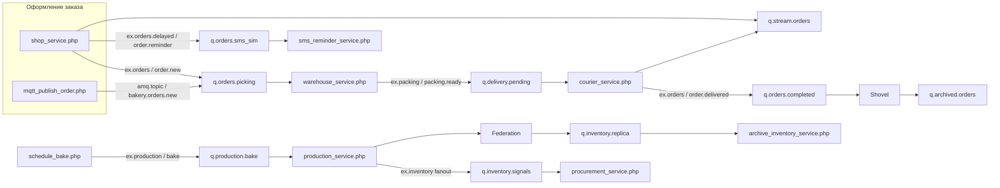

# Итоговый проект: «Серьёзная пекарня» и RabbitMQ

## Краткое описание

Учебная ИТ-архитектура для крупнейшей сети пекарен: интернет-магазин формирует заказы, цех получает задания на выпечку и **автоматически шлёт отчёты о расходе сырья**, склад готовой продукции собирает заказы, курьеры закрывают доставку. Все сервисы общаются через **RabbitMQ**: разные типы **exchange**, **quorum-очереди**, **stream** для аудита заказов, **MQTT** (мобильный клиент), **STOMP**, **TLS**, разграничение прав пользователей, **shovel** (архив завершённых заказов во второй vhost), **federation** (реплика сигналов сырья на архивный vhost), community-плагин **delayed message exchange** (имитация отложенного SMS).

## Структура репозитория

```
Final/
  README.md
  docker/
    docker-compose.yml
    Dockerfile
    rabbitmq.conf
    definitions.json
    enabled_plugins
    certs/                 # появится после scripts/gen-certs.sh
    scripts/
      gen-certs.sh
      apply-shovel-federation.sh
  services/
    composer.json
    composer.lock
    src/
      ConnectionFactory.php
    bin/
      shop_service.php
      warehouse_service.php
      production_service.php
      courier_service.php
      procurement_service.php
      sms_reminder_service.php
      schedule_bake.php
      archive_inventory_service.php
      mqtt_publish_order.php
```

## Топология брокера (кратко)


| Элемент                   | Тип                               | Назначение                                                                       |
| ------------------------- | --------------------------------- | -------------------------------------------------------------------------------- |
| `ex.orders`               | topic                             | Жизненный цикл заказа (`order.new`, `order.delivered`, маска `order.#` → stream) |
| `ex.orders.delayed`       | **x-delayed-message** (community) | Отложенные уведомления (`order.reminder` → `q.orders.sms_sim`)                   |
| `ex.production`           | direct                            | Задания выпечки (`bake`)                                                         |
| `ex.inventory`            | fanout                            | Расход сырья и складские сигналы; **federation** на `bakery_archive`             |
| `ex.packing`              | topic                             | Сборка заказа (`packing.ready` → доставка)                                       |
| `ex.alerts`               | **headers**                       | Критичные закупочные алерты (совпадение заголовков)                              |
| `ex.dlx` + `q.orders.dlq` | direct + quorum                   | DLQ для ошибок обработки на сборке                                               |
| `q.stream.orders`         | **stream**                        | Аудит заказов (bindings с `ex.orders`)                                           |
| `amq.topic`               | встроенный                        | **MQTT**: `bakery/orders/new` → ключ `bakery.orders.new` → `q.orders.picking`    |


Отдельный vhost `**bakery_archive`**: очередь `q.archived.orders` (цель **shovel**) и `q.inventory.replica` (приём **federated** копий `ex.inventory`).

### Учётные записи (учебные, схему для прода сменить)


| Пользователь                      | Роль                                                                                                          |
| --------------------------------- | ------------------------------------------------------------------------------------------------------------- |
| `admin_bakery` / `Admin_Bakery_1` | Администратор, UI                                                                                             |
| `shop_app`                        | Публикация в `ex.orders`, `ex.orders.delayed`                                                                 |
| `warehouse_app`                   | Чтение `q.orders.picking`, запись в `ex.packing`, `ex.delivery`                                               |
| `production_app`                  | Очередь `q.production.bake`, публикация в `ex.inventory`, `ex.alerts`, `ex.production`                        |
| `courier_app`                     | Чтение `q.delivery.pending`, публикация `order.delivered`                                                     |
| `procurement_app`                 | Чтение `q.inventory.signals`                                                                                  |
| `notifier_app`                    | Чтение `q.orders.sms_sim`                                                                                     |
| `ops_shovel`                      | Источник/приёмник для shovel между vhost                                                                      |
| `federation_link`                 | Upstream federation (на `bakery` выданы полные права — так RabbitMQ создаёт служебные `federation:`* очереди) |
| `mqtt_stomp`                      | MQTT/STOMP тесты к `amq.topic`                                                                                |


## PHP-сервисы: подробное описание

Общая библиотека подключения: `src/ConnectionFactory.php`. Она создаёт AMQP-соединение с брокером (по умолчанию `127.0.0.1`, vhost `bakery`) и поддерживает обычный TCP и TLS. Переменные окружения для всех AMQP-скриптов (кроме отдельно оговоренных):


| Переменная          | Назначение                          | Значение по умолчанию                                        |
| ------------------- | ----------------------------------- | ------------------------------------------------------------ |
| `RABBITMQ_HOST`     | Хост брокера                        | `127.0.0.1`                                                  |
| `RABBITMQ_PORT`     | Порт AMQP без TLS                   | `5672`                                                       |
| `RABBITMQ_VHOST`    | Виртуальный хост                    | `bakery`                                                     |
| `RABBITMQ_TLS`      | Включить TLS (`true` / `false`)     | `false`                                                      |
| `RABBITMQ_TLS_PORT` | Порт AMQP с TLS                     | `5671`                                                       |
| `RABBITMQ_CAFILE`   | CA для проверки сертификата сервера | `Final/docker/certs/ca.pem` относительно каталога `services` |


### Как сервисы связаны между собой (сквозной сценарий заказа)

Ниже — основной бизнес-поток «интернет-магазин → склад → курьер → архив» и параллельные ветки (выпечка, снабжение, SMS). Кружки на схеме — процессы PHP или внешний MQTT-клиент; прямоугольники — сущности RabbitMQ.




**Порядок по времени (если запустить все воркеры):**

1. Запускаются долгоживущие воркеры: склад, курьер, закупки, уведомления (и при необходимости архив сырья).
2. Разовым вызовом `shop_service.php` или `mqtt_publish_order.php` в очередь попадает новый заказ.
3. Склад забирает сообщение, публикует факт сборки — очередь доставки получает задание.
4. Курьер доставляет и публикует маршрут `order.delivered` → сообщение попадает в `q.orders.completed`, откуда **shovel** перекладывает его в `bakery_archive.q.archived.orders`.
5. Параллельно: отложенное напоминание из `shop_service` через delayed exchange через несколько секунд попадает в `q.orders.sms_sim` и выводится воркером «SMS».
6. Линия производства: `schedule_bake.php` кладёт задание в `q.production.bake`, `production_service.php` потребляет его и рассылает отчёт о расходе сырья в fanout `ex.inventory`; **procurement** видит то же на основном сайте, **federation** дублирует событие в `bakery_archive`, **archive_inventory_service.php** может это читать.

Ниже — отдельно по каждому файлу в `services/bin/`.

---

### `shop_service.php` — интернет-магазин (AMQP)


|                          |                                                                                                                                                                                                                                                       |
| ------------------------ | ----------------------------------------------------------------------------------------------------------------------------------------------------------------------------------------------------------------------------------------------------- |
| **Роль в домене**        | Имитация успешной оплаты заказа: тело заказа (позиции, адрес, телефон) уходит в систему сборки и в аудит.                                                                                                                                             |
| **Пользователь брокера** | `shop_app`                                                                                                                                                                                                                                            |
| **Публикации**           | В `**ex.orders`** с ключом `order.new` (JSON). Копия события попадёт в `**q.stream.orders**` по привязке `order.#`. В `**ex.orders.delayed**` с ключом `order.reminder` и заголовком `**x-delay**` (миллисекунды) — имитация отложенного SMS клиенту. |
| **Потребления**          | Нет (разовый клиент).                                                                                                                                                                                                                                 |
| **Переменные**           | `SHOP_PASS` (пароль, иначе `Shop_Secret_1`), `DEMO_ORDER_ID` — явный номер заказа для повторяемых тестов, `SMS_DELAY_MS` — задержка напоминания (по умолчанию `5000`).                                                                                |


---

### `mqtt_publish_order.php` — альтернативный вход заказа (MQTT + тот же маршрут склада)


|                   |                                                                                                                                                                                      |
| ----------------- | ------------------------------------------------------------------------------------------------------------------------------------------------------------------------------------ |
| **Роль в домене** | То же, что мобильное приложение или IoT-шлюз: заказ приходит по протоколу MQTT, а RabbitMQ сопоставляет топик с `**amq.topic`**.                                                     |
| **Клиент**        | Библиотека `php-mqtt/client`, пользователь `**mqtt_stomp`**.                                                                                                                         |
| **Публикации**    | Топик `**bakery/orders/new`** (на брокере это маршрут `bakery.orders.new` на `**amq.topic**`). Сообщение попадает в ту же `**q.orders.picking**`, что и заказ из `shop_service.php`. |
| **Переменные**    | `MQTT_PORT` (по умолчанию `1883`), `MQTT_USER`, `MQTT_PASS`, `DEMO_ORDER_ID`, `RABBITMQ_HOST`.                                                                                       |


Имеет смысл держать запущенным `**warehouse_service.php`**, иначе сообщения накапливаются в очереди.

---

### `warehouse_service.php` — склад готовой продукции / сборщик


|                          |                                                                                                                                           |
| ------------------------ | ----------------------------------------------------------------------------------------------------------------------------------------- |
| **Роль в домене**        | Читает очередь заказов на сборку, «собирает» заказ (лог в консоль) и отдаёт пакет в контур доставки.                                      |
| **Пользователь брокера** | `warehouse_app`                                                                                                                           |
| **Потребления**          | `**q.orders.picking`** (quorum, с DLX на `q.orders.dlq` при отказах обработки на стороне брокера/consumer).                               |
| **Публикации**           | `**ex.packing`**, ключ `packing.ready` — JSON с `order_id`, `picker_id`, позициями. По привязкам это попадает в `**q.delivery.pending**`. |
| **Режим**                | Долгоживущий воркер (`basic_consume` + цикл `wait`).                                                                                      |


---

### `courier_service.php` — курьер


|                          |                                                                                                                                                                                                                                                      |
| ------------------------ | ---------------------------------------------------------------------------------------------------------------------------------------------------------------------------------------------------------------------------------------------------- |
| **Роль в домене**        | Забирает собранные заказы, имитирует доставку и фиксирует завершение заказа для биллинга и архива.                                                                                                                                                   |
| **Пользователь брокера** | `courier_app`                                                                                                                                                                                                                                        |
| **Потребления**          | `**q.delivery.pending`**.                                                                                                                                                                                                                            |
| **Публикации**           | `**ex.orders`**, ключ `**order.delivered**` — JSON с `order_id`, `courier_id`, временем. Сообщение уходит в `**q.orders.completed**`. Маршрут `order.delivered` также матчится с маской `**order.#**` и дублируется в `**q.stream.orders**` (аудит). |
| **Режим**                | Долгоживущий воркер.                                                                                                                                                                                                                                 |


Дальше сообщение забирает **dynamic shovel** в vhost `**bakery_archive`** (см. скрипт `apply-shovel-federation.sh`), если он уже применён.

---

### `sms_reminder_service.php` — имитация SMS после задержки


|                          |                                                                                                                |
| ------------------------ | -------------------------------------------------------------------------------------------------------------- |
| **Роль в домене**        | Отдельный микросервис уведомлений: потребляет уже «отложенные» брокером сообщения (как SMS клиенту о статусе). |
| **Пользователь брокера** | `notifier_app` (узкое право только на `**q.orders.sms_sim`**).                                                 |
| **Потребления**          | `**q.orders.sms_sim`** (сообщения приходят из `**ex.orders.delayed**` после истечения `x-delay`).              |
| **Публикации**           | Нет.                                                                                                           |
| **Переменные**           | `NOTIFIER_PASS`.                                                                                               |
| **Режим**                | Долгоживущий воркер.                                                                                           |


Имеет смысл запускать **до** или сразу после запуска `shop_service.php`, иначе напоминания накопятся в очереди.

---

### `schedule_bake.php` — планировщик / MES: задание на выпечку


|                          |                                                                                                                                                                         |
| ------------------------ | ----------------------------------------------------------------------------------------------------------------------------------------------------------------------- |
| **Роль в домене**        | Имитирует ERP или диспетчера цеха: отправляет партию в работу поварам.                                                                                                  |
| **Пользователь брокера** | `production_app`                                                                                                                                                        |
| **Публикации**           | `**ex.production`**, ключ `**bake**` — JSON с `batch_id`, линией, флагом `simulate_critical_stock`.                                                                     |
| **Потребления**          | Нет (одноразовый скрипт).                                                                                                                                               |
| **Переменные**           | `BATCH_ID`, `SIMULATE_CRITICAL` (`true`/`false`) — если `true`, последующий запуск `**production_service.php`** дополнительно пошлёт критичный алерт в `**ex.alerts**`. |


---

### `production_service.php` — производство / повар


|                          |                                                                                                                                                                                                                                                                                                                                                                                              |
| ------------------------ | -------------------------------------------------------------------------------------------------------------------------------------------------------------------------------------------------------------------------------------------------------------------------------------------------------------------------------------------------------------------------------------------- |
| **Роль в домене**        | Выпекает партию по заданию, автоматически формирует **отчёт о расходе сырья** (fanout) и при необходимости — **критичный алерт закупкам** (headers exchange).                                                                                                                                                                                                                                |
| **Пользователь брокера** | `production_app`                                                                                                                                                                                                                                                                                                                                                                             |
| **Потребления**          | `**q.production.bake`**.                                                                                                                                                                                                                                                                                                                                                                     |
| **Публикации**           | В `**ex.inventory`** (пустой routing key, fanout) — JSON с расходом муки, сахара и т.д.; то же через **federation** может оказаться на `**bakery_archive`** у `**q.inventory.replica**`. При `simulate_critical_stock` во входящем задании — в `**ex.alerts**` с заголовками `level=critical`, `subsystem=raw_material` (попадание в `**q.procurement.critical**` задано привязкой headers). |
| **Режим**                | Долгоживущий воркер.                                                                                                                                                                                                                                                                                                                                                                         |


Один раз нужно вызвать `**schedule_bake.php`**, чтобы в очереди появилось сообщение (или вызывать его по расписанию).

---

### `procurement_service.php` — закупки / сырьевой контур


|                          |                                                                                                                                                                                                  |
| ------------------------ | ------------------------------------------------------------------------------------------------------------------------------------------------------------------------------------------------ |
| **Роль в домене**        | Автоматизация реакции на складские и производственные сигналы: любое сообщение из fanout `**ex.inventory`** (расход, балансы, будущие расширения) попадает в одну очередь для сервиса снабжения. |
| **Пользователь брокера** | `procurement_app`                                                                                                                                                                                |
| **Потребления**          | `**q.inventory.signals`**.                                                                                                                                                                       |
| **Публикации**           | Нет.                                                                                                                                                                                             |
| **Режим**                | Долгоживущий воркер.                                                                                                                                                                             |


Критичные алерты из `**ex.alerts`** в этой версии демо уходят в отдельную очередь `**q.procurement.critical**`; отдельного PHP-воркера под неё нет — их видно в Management UI или можно добавить аналогичный consumer.

---

### `archive_inventory_service.php` — архив / второй ЦОД (реплика сырья)


|                          |                                                                                                                         |
| ------------------------ | ----------------------------------------------------------------------------------------------------------------------- |
| **Роль в домене**        | Читает **копию** складских сигналов на vhost `**bakery_archive`**, куда их доставляет **federation** с основного сайта. |
| **Пользователь брокера** | `federation_link`                                                                                                       |
| **Vhost**                | `**bakery_archive`** (подключение задаётся в коде явно, не через `ConnectionFactory`).                                  |
| **Потребления**          | `**q.inventory.replica`**.                                                                                              |
| **Публикации**           | Нет.                                                                                                                    |
| **Переменные**           | `FED_PASS`, хост и порт AMQP как у остальных (`RABBITMQ_HOST`, `RABBITMQ_PORT`).                                        |
| **Режим**                | Долгоживущий воркер.                                                                                                    |


Этот процесс не связан напрямую AMQP-сообщениями с `procurement_service.php`: связь **логическая** — оба обрабатывают один и тот же «смысл» события, но в разных vhost (основной сайт и архив).

---

### Сводка: кто с кем обменивается (таблица)


| Откуда               | Куда (маршрут)                       | Очередь / эффект                                           |
| -------------------- | ------------------------------------ | ---------------------------------------------------------- |
| `shop_service`       | `ex.orders` `order.new`              | `q.orders.picking`, `q.stream.orders`                      |
| `mqtt_publish_order` | `amq.topic` `bakery.orders.new`      | `q.orders.picking`                                         |
| `warehouse_service`  | `ex.packing` `packing.ready`         | `q.delivery.pending`                                       |
| `courier_service`    | `ex.orders` `order.delivered`        | `q.orders.completed`, дубль в stream                       |
| `shop_service`       | `ex.orders.delayed` `order.reminder` | через задержку → `q.orders.sms_sim`                        |
| `schedule_bake`      | `ex.production` `bake`               | `q.production.bake`                                        |
| `production_service` | `ex.inventory` (fanout)              | `q.inventory.signals` + federation → `q.inventory.replica` |
| `production_service` | `ex.alerts` (headers)                | `q.procurement.critical` (если флаг критичности)           |
| Shovel (брокер)      | из `bakery` в `q.archived.orders`    | архив завершённых заказов                                  |


## Как запустить проект (Docker + WSL)

Предполагается Docker Desktop для Windows и **WSL2** для shell-команд (пути вида `/mnt/d/...`).

1. **Сертификаты для TLS** (один раз):
  ```bash
   cd /mnt/d/trainings/rabbit-mq/Final/docker/scripts
   chmod +x gen-certs.sh apply-shovel-federation.sh
   ./gen-certs.sh
  ```
   В Git Bash на Windows уже выставлен `MSYS_NO_PATHCONV`, скрипт переключается в каталог `certs` и использует относительные пути — это обходит проблему OpenSSL с путями вида `/d/...`.
2. Поднять брокер:
  ```bash
   cd /mnt/d/trainings/rabbit-mq/Final/docker
   docker compose up -d
  ```
3. После сообщения `Server startup complete` применить **shovel** и **federation** (их нет в `definitions.json` при старте, чтобы избежать гонки плагинов при `load_definitions`):
  ```bash
   cd /mnt/d/trainings/rabbit-mq/Final/docker/scripts
   ./apply-shovel-federation.sh rabbitmq-bakery-final
  ```
4. Установить PHP-зависимости:
  ```bash
   cd /mnt/d/trainings/rabbit-mq/Final/services
   composer install
  ```
5. **Сценарий проверки** (четыре терминала WSL + один для клиента):
  ```bash
   # терминал 1
   php bin/warehouse_service.php
   # терминал 2
   php bin/courier_service.php
   # терминал 3
   php bin/procurement_service.php
   # терминал 4
   php bin/sms_reminder_service.php
  ```
   Затем в отдельном окне:
   Проверка shovel: после `order.delivered` сообщение должно оказаться в `bakery_archive` / `q.archived.orders` (Management UI или `rabbitmqctl list_queues -p bakery_archive`).

## Если уже есть контейнер `rabbitmq` (rabbitmq:3.10-management)

Чтобы не плодить второй брокер, можно:

1. Включить плагины: `rabbitmq_shovel`, `rabbitmq_federation`, `rabbitmq_mqtt`, `rabbitmq_stomp`, `rabbitmq_stream`, `rabbitmq_delayed_message_exchange` (файл `.ez` — как в нашем `Dockerfile`), `rabbitmq_management` уже есть.
2. Смонтировать `rabbitmq.conf` (или руками выставить порты TLS/MQTT/STOMP/stream).
3. Импортировать `Final/docker/definitions.json` через Management → *Import definitions* либо `rabbitmqctl import_definitions`.
4. Выполнить `apply-shovel-federation.sh`, подставив имя своего контейнера:
  ```bash
   ./apply-shovel-federation.sh rabbitmq-test
  ```

Необходимо учесть конфликт **портов**, если у существующего контейнера уже проброшены `5672`, `15672`, `1883` и т.д.

## Подключение по TLS из PHP

```bash
export RABBITMQ_TLS=true
export RABBITMQ_TLS_PORT=5671
export RABBITMQ_CAFILE=/mnt/d/trainings/rabbit-mq/Final/docker/certs/ca.pem
php bin/shop_service.php
```

На брокере TLS слушает `5671`, клиентские сертификаты не требуются (`fail_if_no_peer_cert = false`).

## MQTT и STOMP без PHP

- **MQTT** (порт `1883`, пользователь `mqtt_stomp`):
  ```bash
  mosquitto_pub -h 127.0.0.1 -p 1883 -u mqtt_stomp -P Mqtt_Secret_1 \
    -t 'bakery/orders/new' -m '{"order_id":"MQTT-CLI-1","items":[]}'
  ```
- **STOMP** (порт `61613`): можно использовать `stomp.py` или браузерный *RabbitMQ Web STOMP* (в этом проекте не поднят; достаточно нативного `rabbitmq_stomp`). Пример кадра подключения:
  ```
  CONNECT
  login:mqtt_stomp
  passcode:Mqtt_Secret_1
  host:bakery

  ^@
  ```
  Далее `SEND` с заголовком `destination:/exchange/amq.topic/bakery.orders.new`.

## Полезные команды диагностики

```bash
docker exec rabbitmq-bakery-final rabbitmqctl shovel_status
docker exec rabbitmq-bakery-final rabbitmqctl federation_status
docker exec rabbitmq-bakery-final rabbitmqctl list_queues -p bakery name messages
docker exec rabbitmq-bakery-final rabbitmq-plugins list | grep -E 'mqtt|stomp|shovel|federation|stream|delayed'
```

Заменить `rabbitmq-bakery-final` на имя нужного контейнера, если оно другое.

## Почему shovel/federation вынесены в скрипт

При одновременной загрузке `definitions.json` и старте плагинов RabbitMQ 3.10 в гонке падал с ошибками `rabbit_shovel_dyn_worker_sup_sup` и применением federation policy до готовности vhost. Отложенное применение через `apply-shovel-federation.sh` после `await_startup` стабилизирует демонстрацию.

---

**Management UI:** [http://localhost:15672](http://localhost:15672) — логин `admin_bakery` / `Admin_Bakery_1`.